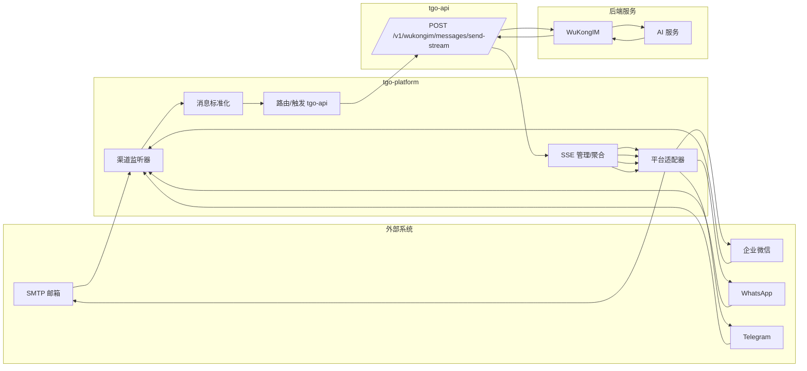
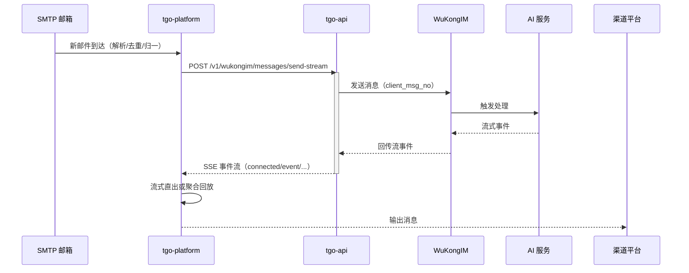
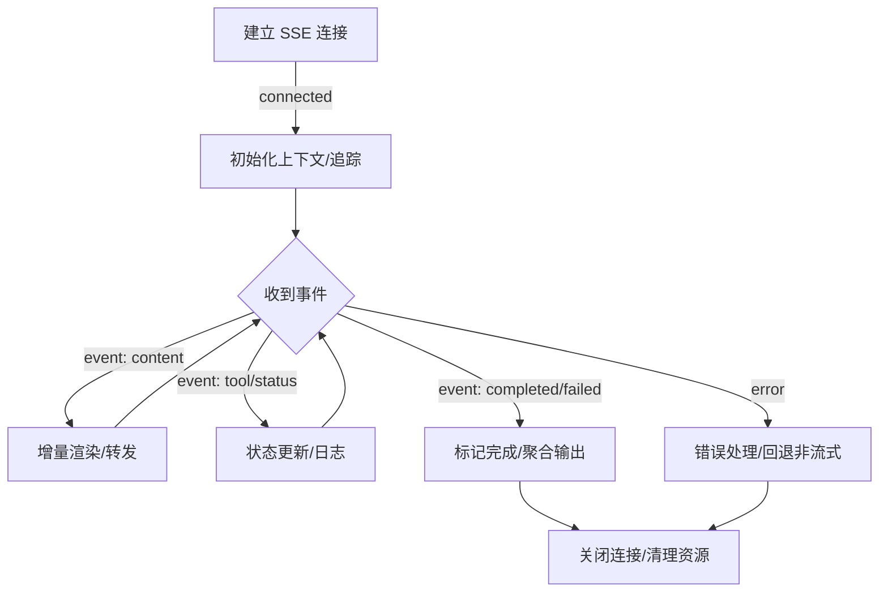
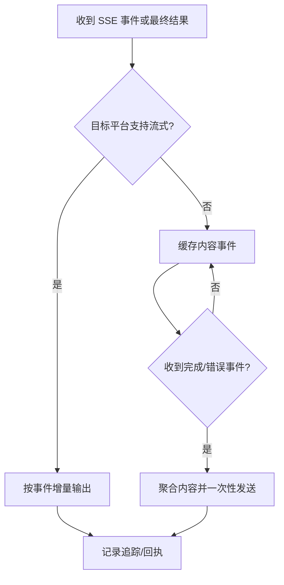
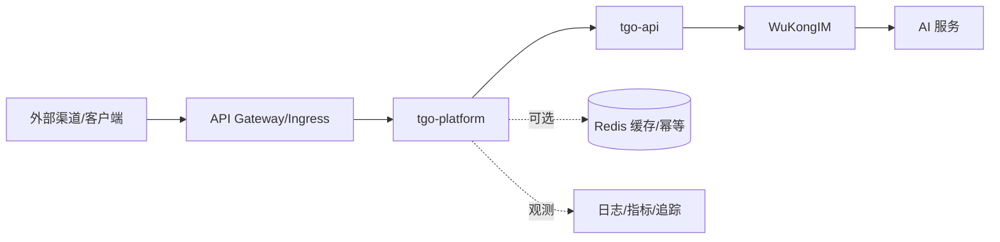

## tgo-platform 技术架构文档

### 1. 系统概述（目标、定位、核心能力）
- 目标：统一接入并聚合第三方平台消息，利用内部 AI 能力进行处理，按目标平台能力以流式（SSE）或非流式方式输出，提升多渠道客服/通知的效率与一致性。
- 定位：面向多渠道（企业微信、Email、WhatsApp、Telegram 等）的消息编排与转发中枢，屏蔽渠道差异，提供一致的接口与观测能力。
- 核心能力：
  - 多渠道接入与监听（SMTP、Webhook、轮询）
  - 消息标准化与路由
  - 调用 tgo-api 的流式对话接口（SSE）
  - 平台适配（流式直出 / 非流式聚合回放）
  - 可靠性与可观测性（超时、重试、幂等、追踪）

> 术语：SSE（Server-Sent Events）是一种服务端向客户端单向推送的 HTTP 流式协议；WuKongIM 为消息路由/IM 能力后端；correlation_id/request_id 用于端到端链路追踪。

---

### 2. 技术架构（分层架构、核心组件、技术栈）
#### 2.1 分层架构
- 接入层（Ingestion）
  - 渠道监听器：Email(SMTP)、企业微信/WhatsApp/Telegram（Webhook/轮询）
  - 去重与幂等：基于 Message-ID/事件 ID/指纹
- 编排层（Orchestration）
  - 标准化/归一化：统一消息模型
  - 路由与触发：构造请求并调用 tgo-api
  - 流管控：SSE 连接管理、事件缓冲、超时与取消
- 适配层（Adapters）
  - 平台适配：按平台能力输出（流式直出/非流式聚合）
  - 限流与分片：平台限额与速率策略
- 支撑层（Foundation）
  - 配置与密钥管理、日志/指标/追踪、错误处理与重试

#### 2.2 核心组件
- Channel Listener（渠道监听器）
- Message Normalizer（消息标准化）
- Dispatcher/Router（路由/触发器）
- tgo-api Client + SSE Manager（HTTP + SSE）
- Stream Aggregator（流聚合器）
- Platform Adapters（平台适配器：WeCom/Email/WhatsApp/Telegram）
- Reliability Utilities（重试、超时、幂等、告警）

#### 2.3 技术栈（抽象）
- 协议：HTTP/HTTPS、SMTP、SSE
- 数据格式：JSON（统一消息模型与接口协议）
- 对接：WuKongIM（消息路由）+ AI 服务（推理）
- 参考实现建议（可选）：使用内存/Redis 做短期缓冲与幂等；使用结构化日志与分布式追踪（request_id/correlation_id）。

---

### 3. 系统整体架构图（Mermaid）


---

### 4. 消息流转机制（各渠道流程）
#### 4.1 Email（SMTP）
1) 监听：基于 IMAP/POP3/SMTP 钩子或轮询，拉取新邮件；做去重/幂等。
2) 归一：抽取发件人、主题、正文、附件，映射为统一消息模型并确定 channel_id/from_uid。
3) 触发：构造请求体（见 5. 接口规范），调用 tgo-api 的 SSE 接口。
4) 接收：维护 SSE 连接，按事件到达进行转发或缓存。
5) 适配：
   - 支持流式的平台：事件到达即转发更新（增量输出）。
   - 不支持流式的平台：缓存内容事件，等待完成事件后一次性发送。



#### 4.2 企业微信 / WhatsApp / Telegram（通用）
- Webhook 推送或轮询获取消息 → 标准化 → 调用 tgo-api（SSE）→ 平台适配。
- 关键差异：是否支持流式消息、消息长度与速率限制、富媒体支持与回执语义。

---

### 5. 接口规范（核心 API）
基于 docs/tgo-api.json 的定义，复用并精简关键要点：

#### 5.1 发送并流式返回（SSE）
- 方法：POST
- 路径：/v1/wukongim/messages/send-stream
- 认证：请求体字段 api_key（401 表示无效）
- 返回：SSE（text/event-stream），事件名：connected | event | error | disconnected

请求体（MessageSendStreamRequest）：
- 必填：
  - api_key: string，平台 API Key
  - message: string，文本内容
  - channel_id: string，WuKongIM 渠道 ID
  - channel_type: integer，1=个人，2=群组
  - from_uid: string，发送方用户 ID（如 visitor ID）
- 可选：
  - extra: object，附加元数据
  - timeout_seconds: integer，默认 120，范围 1–600

请求示例：
```json
{
  "api_key": "your_api_key",
  "message": "Hello",
  "channel_id": "ch_123",
  "channel_type": 1,
  "from_uid": "visitor_001"
}
```

SSE 事件（节选）：
```text
event: connected
data: {"message":"Stream connected","request_id":"req-123","correlation_id":"corr-456"}

event: event
data: {"event_type":"team_member_content","timestamp":"2024-05-01T12:00:03Z","data":{"content_chunk":"...","is_final":false}}

event: disconnected
data: {"message":"Stream disconnected"}
```

错误：
- 401 Invalid api_key
- 422 Validation Error（参见通用 ErrorResponse）

设计与使用要点：
- 记录 request_id/correlation_id 以便排障与统计
- 对非流式平台采用内容事件缓存并以完成事件为发送触发
- 使用 timeout_seconds 限制最大等待时长，必要时回退为非流式路径

---

### 6. SSE 流式响应处理流程（Mermaid）


---

### 7. 平台适配决策流程（Mermaid）


---

### 8. 部署架构（可选）
- 推荐分层部署与水平扩展，tgo-platform 与 tgo-api 可独立伸缩。
- 建议使用反向代理/网关做统一入口与超时/重试控制；使用对象存储或消息队列视需求引入。
- 短期缓存/幂等可选用内存或 Redis；持久化与监控按企业规范选型。



---

### 9. 参考与延伸
- 参考文档：docs/tgo-platform-tech.md（核心概念与接口说明来源）
- 设计理念：以“解耦、可观测、可回退”为原则，优先保障用户可见性与稳定性。
- 后续可扩展：
  - 平台能力画像与策略中心（分渠道限速/限额/富媒体策略）
  - 更精细的事件语义映射与模板渲染
  - 多副本连接复用与断线重连优化

