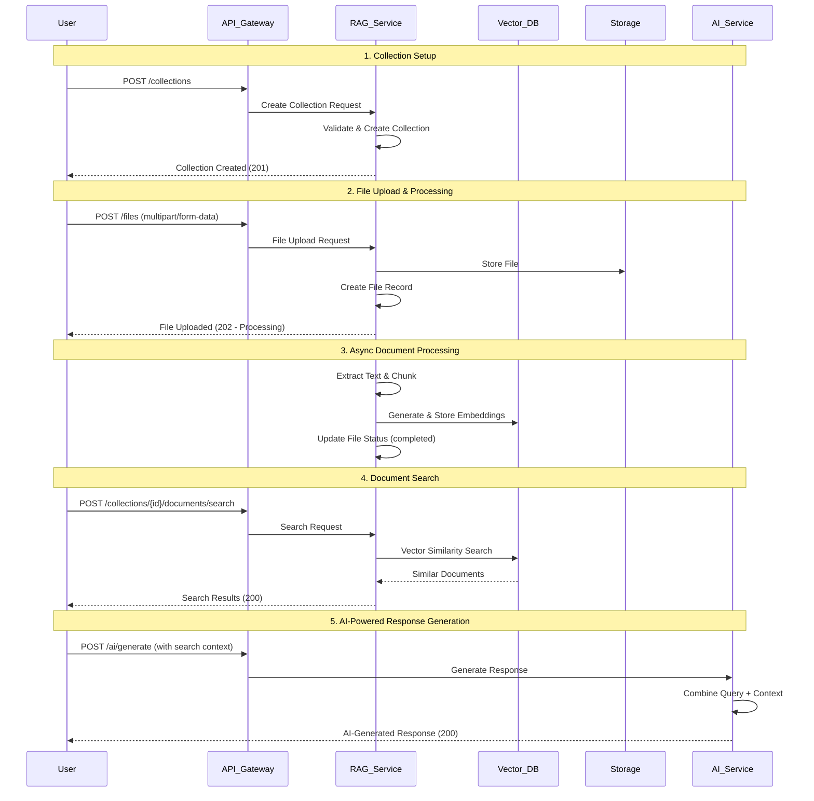
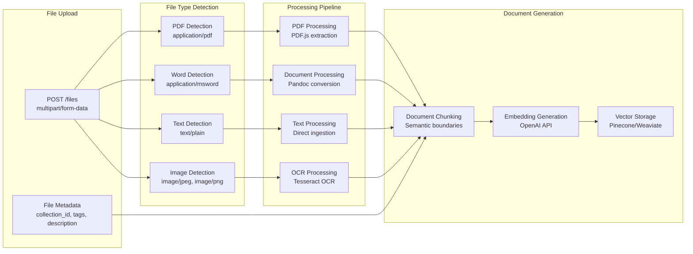
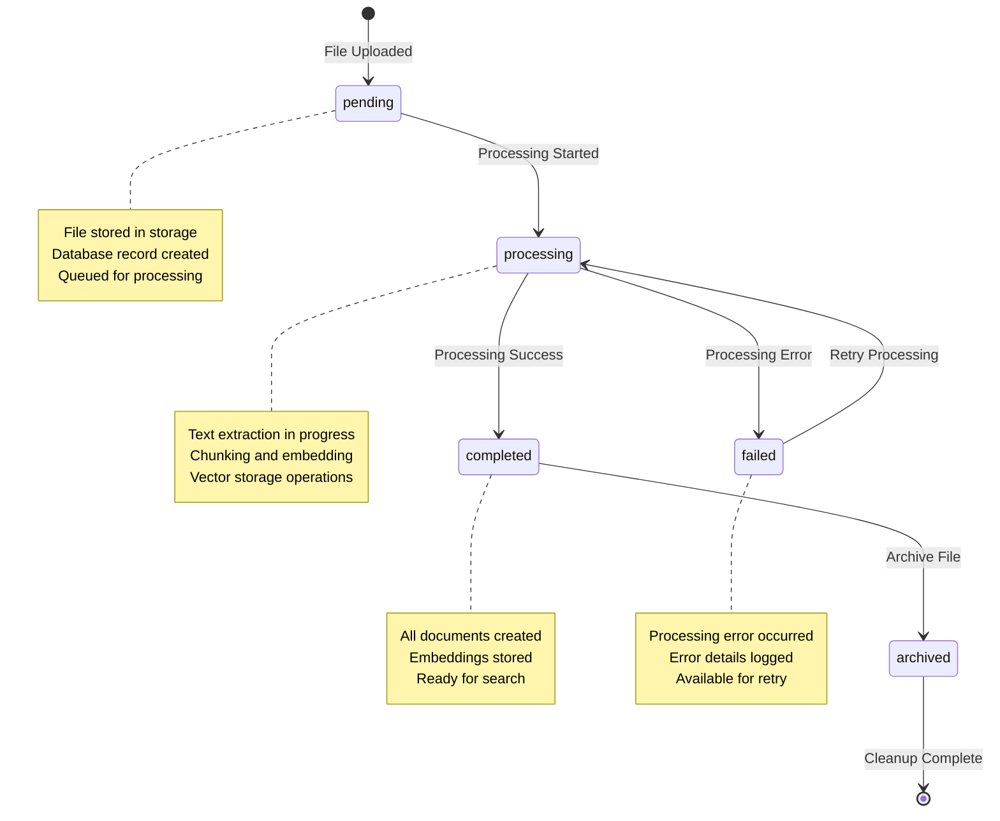
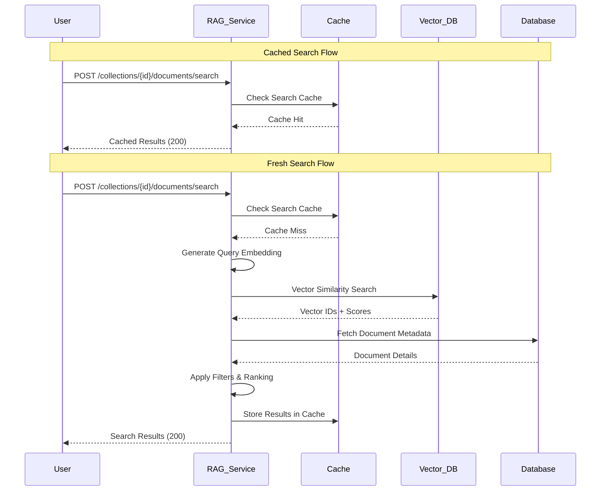
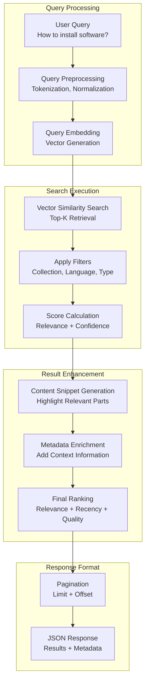
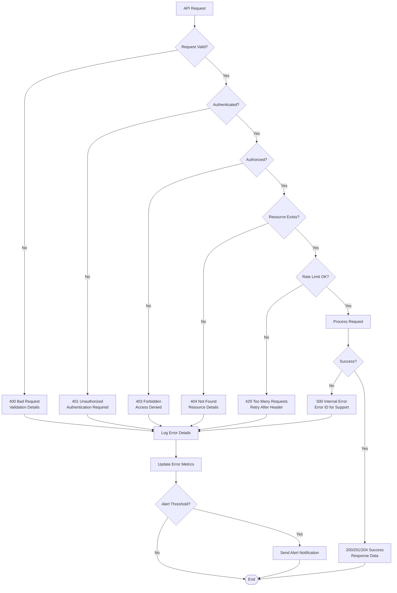
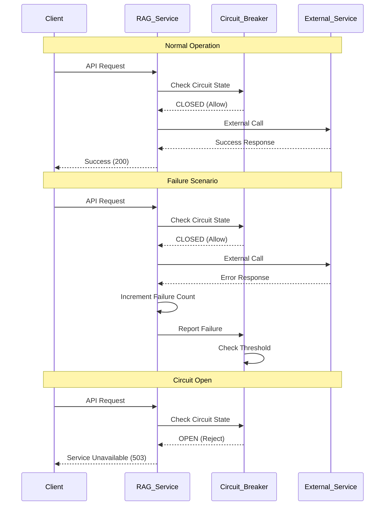

# TGO-Tech RAG Service API Workflows

## Overview

This document describes the complete API workflows and user journeys for the TGO-Tech RAG Service. It demonstrates how the various endpoints work together to provide a comprehensive document management and search experience.

## Complete RAG Workflow

### End-to-End Document Processing and Search



## Collection Management Workflows

### Collection Lifecycle Management

```mermaid
flowchart TD
    START([User Starts]) --> LIST_COLLECTIONS[GET /collections<br/>List existing collections]
    
    LIST_COLLECTIONS --> DECISION{Collection Exists?}
    DECISION -->|No| CREATE_COLLECTION[POST /collections<br/>Create new collection]
    DECISION -->|Yes| SELECT_COLLECTION[Select existing collection]
    
    CREATE_COLLECTION --> COLLECTION_CREATED[Collection Created<br/>Status: 201]
    SELECT_COLLECTION --> COLLECTION_SELECTED[Collection Selected]
    COLLECTION_CREATED --> COLLECTION_SELECTED
    
    COLLECTION_SELECTED --> GET_DETAILS[GET /collections/{id}<br/>Get collection details]
    GET_DETAILS --> MANAGE_DOCS[Manage Documents<br/>in Collection]
    
    MANAGE_DOCS --> UPLOAD_FILES[POST /files<br/>Upload files to collection]
    MANAGE_DOCS --> CREATE_DOCS[POST /collections/{id}/documents<br/>Create documents directly]
    MANAGE_DOCS --> SEARCH_DOCS[POST /collections/{id}/documents/search<br/>Search within collection]
    MANAGE_DOCS --> LIST_DOCS[GET /collections/{id}/documents<br/>List collection documents]
    
    UPLOAD_FILES --> PROCESSING[Async Processing<br/>File → Documents]
    CREATE_DOCS --> PROCESSING
    PROCESSING --> READY[Documents Ready<br/>for Search]
    
    SEARCH_DOCS --> RESULTS[Search Results<br/>with Relevance Scores]
    LIST_DOCS --> DOC_LIST[Paginated Document List]
    
    RESULTS --> AI_INTEGRATION[Optional: AI Service<br/>Response Generation]
    DOC_LIST --> DOCUMENT_MGMT[Document Management<br/>Operations]
    
    DOCUMENT_MGMT --> DELETE_DOC[DELETE /collections/{id}/documents/{doc_id}<br/>Remove specific document]
    
    AI_INTEGRATION --> END([Workflow Complete])
    DELETE_DOC --> END
```

### Collection Organization Strategy

```mermaid
graph TB
    subgraph "Project Level"
        PROJECT[Project: Customer Support]
    end
    
    subgraph "Collection Organization"
        COLL1[Collection: Product Manuals<br/>Metadata: {type: 'manual', version: '2.1'}]
        COLL2[Collection: FAQ Documents<br/>Metadata: {type: 'faq', language: 'en'}]
        COLL3[Collection: Technical Specs<br/>Metadata: {type: 'technical', audience: 'developers'}]
    end
    
    subgraph "Document Distribution"
        COLL1 --> FILES1[Files: PDF Manuals<br/>Documents: 150 chunks]
        COLL2 --> FILES2[Files: FAQ Text<br/>Documents: 75 chunks]
        COLL3 --> FILES3[Files: API Docs<br/>Documents: 200 chunks]
    end
    
    subgraph "Search Strategies"
        FILES1 --> SEARCH1[Search: User Guides<br/>Filter: content_type=paragraph]
        FILES2 --> SEARCH2[Search: Quick Answers<br/>Filter: confidence>0.8]
        FILES3 --> SEARCH3[Search: Code Examples<br/>Filter: content_type=code]
    end
    
    PROJECT --> COLL1
    PROJECT --> COLL2
    PROJECT --> COLL3
```

## File Processing Workflows

### Multi-Format File Processing



### File Status Monitoring



## Search and Retrieval Workflows

### Advanced Search Patterns



### Search Result Optimization



## Error Handling Workflows

### Comprehensive Error Management



### Retry and Circuit Breaker Patterns



This comprehensive API workflow documentation provides clear guidance on how to effectively use the RAG service endpoints to build powerful document processing and search applications.
