# TGO-Tech RAG Service Architecture

## Overview

The TGO-Tech RAG (Retrieval-Augmented Generation) Service is a microservice-based system designed to handle document processing, vector embedding generation, and semantic search capabilities for AI-powered customer service operations. The architecture follows a distributed design pattern with clear separation of concerns across multiple services.

## System Architecture

### High-Level Architecture

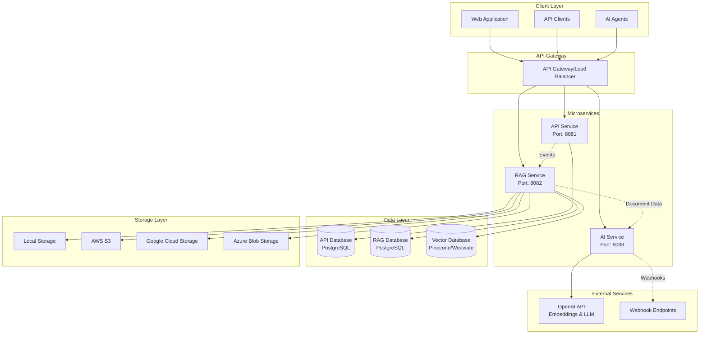

### Service Component Diagram

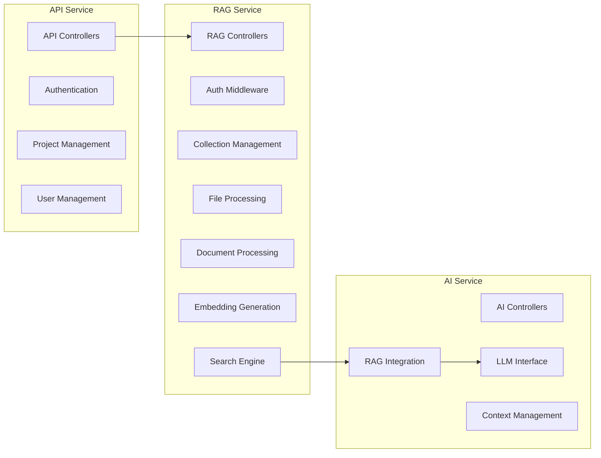

## Database Schema Architecture

### Entity Relationship Diagram

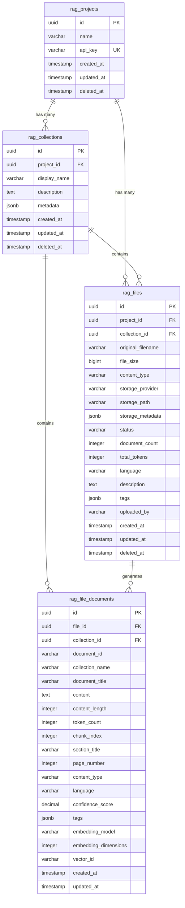

### Data Relationships

- **Projects**: Top-level tenant isolation with synchronized data from API service
- **Collections**: Logical grouping of documents within projects for better organization
- **Files**: Physical file storage with metadata and processing status
- **Documents**: Processed document chunks with vector embeddings for RAG operations

## Authentication & Authorization Flow

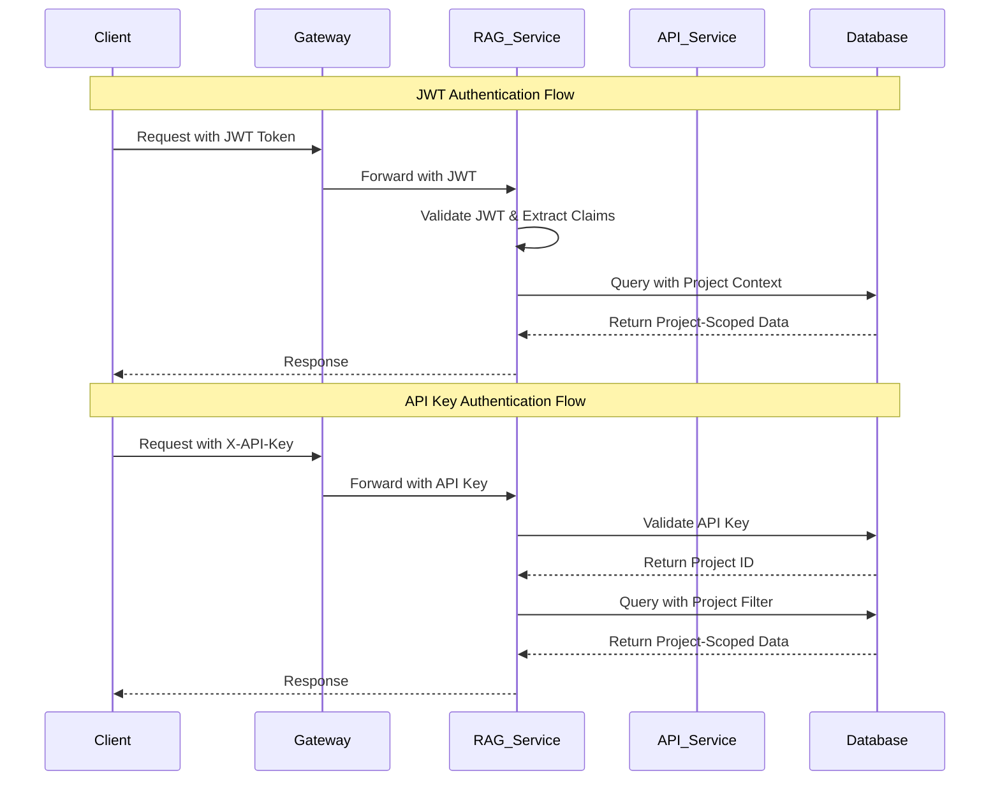

## Technology Stack

### Core Technologies
- **Runtime**: Node.js / Python (depending on service)
- **Framework**: Express.js / FastAPI
- **Database**: PostgreSQL 14+
- **Vector Database**: Pinecone / Weaviate / Chroma
- **Message Queue**: Redis / RabbitMQ
- **Caching**: Redis

### Storage & Processing
- **File Storage**: Local, AWS S3, Google Cloud Storage, Azure Blob
- **Document Processing**: PDF.js, Tesseract OCR, Pandoc
- **Embedding Models**: OpenAI text-embedding-ada-002, Sentence Transformers
- **Search**: Vector similarity search with hybrid keyword matching

### Infrastructure
- **Containerization**: Docker
- **Orchestration**: Kubernetes / Docker Compose
- **Monitoring**: Prometheus, Grafana
- **Logging**: ELK Stack (Elasticsearch, Logstash, Kibana)

## External Integrations

### Vector Database Integration

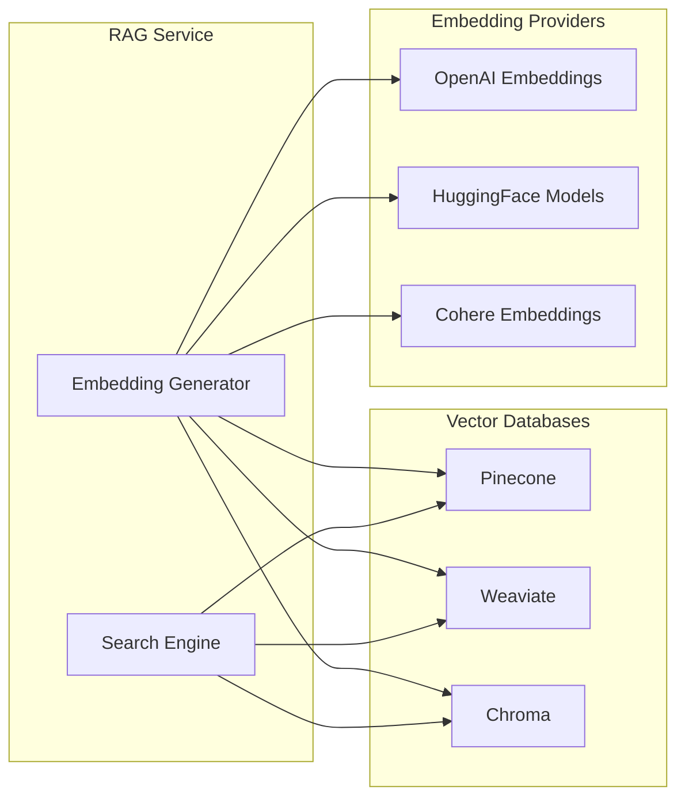

### Storage Provider Architecture

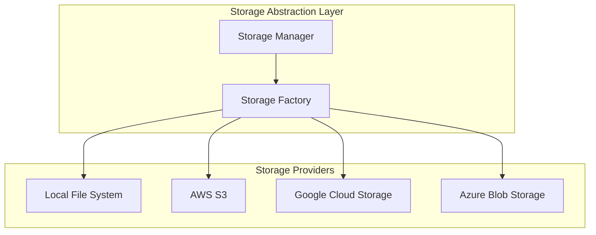

## Performance & Scalability Considerations

### Horizontal Scaling
- **Stateless Services**: All services are designed to be stateless for easy horizontal scaling
- **Database Sharding**: Project-based sharding strategy for large-scale deployments
- **Vector Database Partitioning**: Collection-based partitioning for vector storage
- **CDN Integration**: Static file serving through CDN for global distribution

### Caching Strategy
- **Application Cache**: Redis for frequently accessed metadata
- **Vector Cache**: In-memory caching of recent embedding results
- **Database Query Cache**: PostgreSQL query result caching
- **File Cache**: Local caching of frequently accessed files

### Performance Metrics
- **Document Processing**: Target 100ms per page for text extraction
- **Embedding Generation**: Batch processing for optimal throughput
- **Search Latency**: Sub-200ms response time for semantic search
- **File Upload**: Streaming upload for large files with progress tracking

## Security Architecture

### Data Protection
- **Encryption at Rest**: AES-256 encryption for stored files and database
- **Encryption in Transit**: TLS 1.3 for all service communications
- **API Security**: Rate limiting, request validation, and CORS protection
- **Access Control**: Role-based access control (RBAC) with project isolation

### Compliance
- **Data Privacy**: GDPR and CCPA compliance for document handling
- **Audit Logging**: Comprehensive audit trails for all operations
- **Data Retention**: Configurable retention policies for documents and embeddings
- **Backup & Recovery**: Automated backup with point-in-time recovery

## Deployment Architecture

### Container Strategy
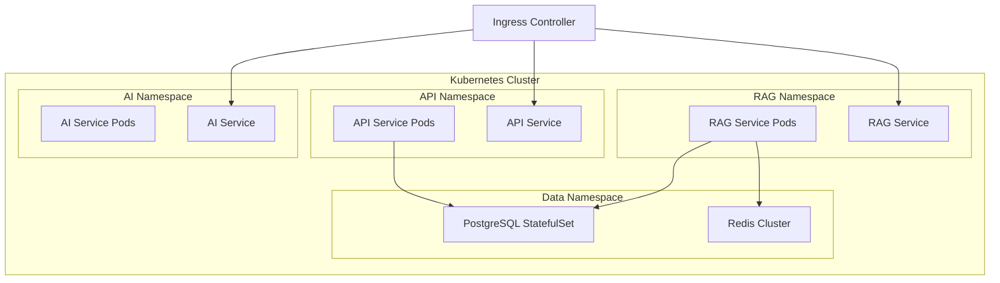

## Monitoring & Observability

### Application Monitoring Stack

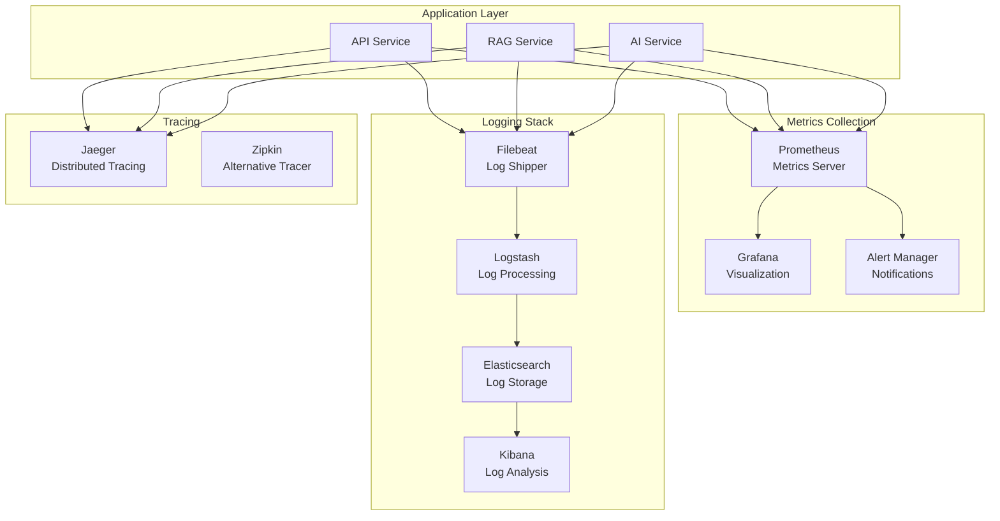

### Key Performance Indicators (KPIs)

#### Service-Level Metrics
- **Request Latency**: P50, P95, P99 response times
- **Throughput**: Requests per second (RPS)
- **Error Rate**: 4xx and 5xx error percentages
- **Availability**: Service uptime percentage

#### RAG-Specific Metrics
- **Document Processing Time**: Average time per document/page
- **Embedding Generation Rate**: Embeddings per second
- **Search Latency**: Vector search response time
- **Index Size**: Number of vectors and storage usage
- **Chunk Quality**: Average confidence scores

#### Resource Utilization
- **CPU Usage**: Per service and container
- **Memory Usage**: Heap and non-heap memory
- **Disk I/O**: Read/write operations and latency
- **Network I/O**: Bandwidth utilization

### Health Check Implementation

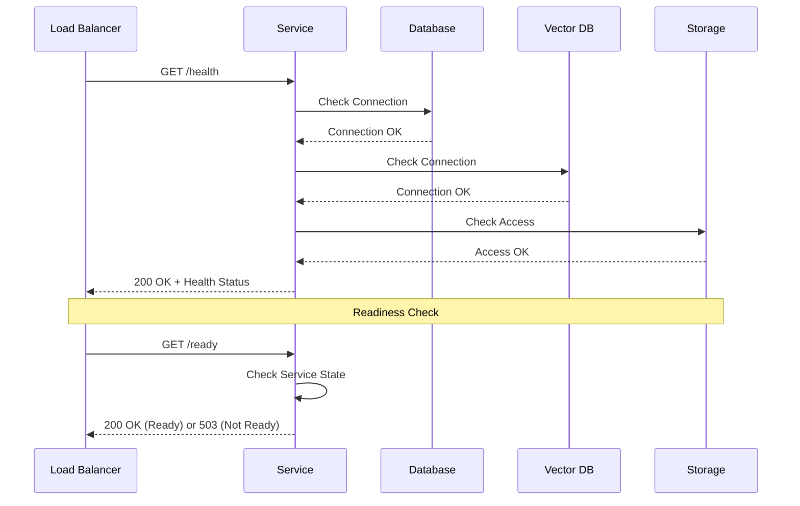

## Disaster Recovery & Business Continuity

### Backup Strategy

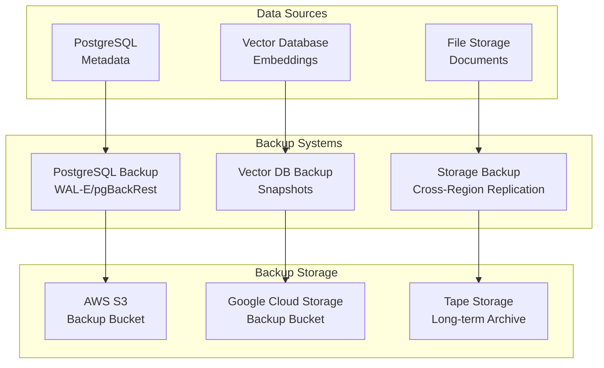

### Multi-Region Deployment

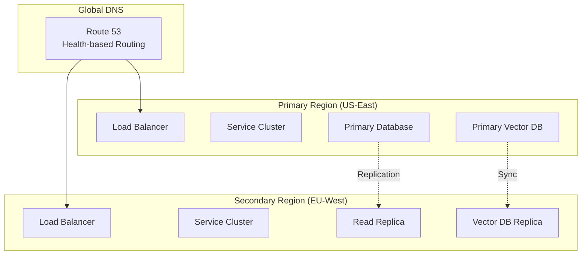

This architecture provides a robust, scalable foundation for RAG operations with comprehensive monitoring, disaster recovery capabilities, and flexible deployment options across multiple regions.
