# TGO-Tech RAG Service Data Flow

## Overview

This document describes the data flow patterns and processing pipelines within the TGO-Tech RAG Service. The system handles document ingestion, processing, vector embedding generation, and semantic search operations through well-defined workflows.

## Document Ingestion Pipeline

### Complete Document Processing Flow

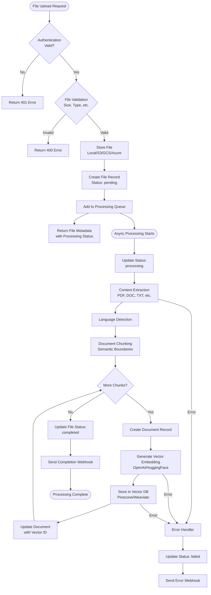
```mermaid
flowchart TD
    START([File Upload Request]) --> AUTH{Authentication<br/>Valid?}
    AUTH -->|No| AUTH_ERROR[Return 401 Error]
    AUTH -->|Yes| VALIDATE{File Validation<br/>Size, Type, etc.}
    
    VALIDATE -->|Invalid| VALIDATION_ERROR[Return 400 Error]
    VALIDATE -->|Valid| STORAGE[Store File<br/>Local/S3/GCS/Azure]
    
    STORAGE --> DB_RECORD[Create File Record<br/>Status: pending]
    DB_RECORD --> QUEUE[Add to Processing Queue]
    QUEUE --> RESPONSE[Return File Metadata<br/>with Processing Status]
    
    QUEUE --> ASYNC_START([Async Processing Starts])
    ASYNC_START --> UPDATE_STATUS1[Update Status:<br/>processing]
    UPDATE_STATUS1 --> EXTRACT[Content Extraction<br/>PDF, DOC, TXT, etc.]
    
    EXTRACT --> DETECT_LANG[Language Detection]
    DETECT_LANG --> CHUNK[Document Chunking<br/>Semantic Boundaries]
    
    CHUNK --> LOOP_START{More Chunks?}
    LOOP_START -->|Yes| CREATE_DOC[Create Document Record]
    CREATE_DOC --> GENERATE_EMBED[Generate Vector Embedding<br/>OpenAI/HuggingFace]
    GENERATE_EMBED --> STORE_VECTOR[Store in Vector DB<br/>Pinecone/Weaviate]
    STORE_VECTOR --> UPDATE_DOC[Update Document<br/>with Vector ID]
    UPDATE_DOC --> LOOP_START
    
    LOOP_START -->|No| UPDATE_STATUS2[Update File Status:<br/>completed]
    UPDATE_STATUS2 --> WEBHOOK[Send Completion Webhook]
    WEBHOOK --> END([Processing Complete])
    
    EXTRACT -->|Error| ERROR_HANDLER[Error Handler]
    GENERATE_EMBED -->|Error| ERROR_HANDLER
    STORE_VECTOR -->|Error| ERROR_HANDLER
    ERROR_HANDLER --> UPDATE_STATUS3[Update Status: failed]
    UPDATE_STATUS3 --> ERROR_WEBHOOK[Send Error Webhook]
```

### Document Chunking Strategy

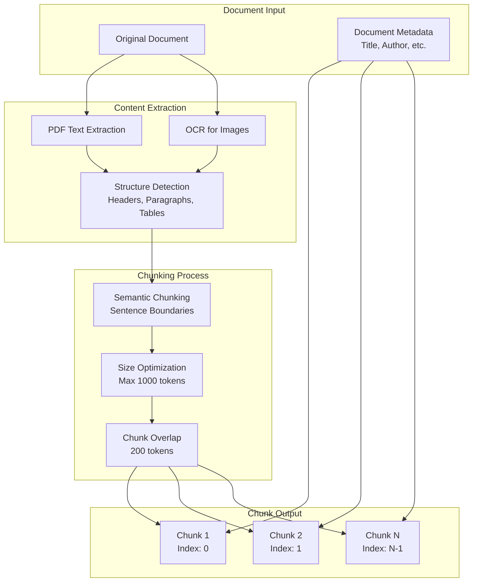
```mermaid
graph TB
    subgraph "Document Input"
        DOC[Original Document]
        METADATA[Document Metadata<br/>Title, Author, etc.]
    end
    
    subgraph "Content Extraction"
        PDF_EXTRACT[PDF Text Extraction]
        OCR[OCR for Images]
        STRUCTURE[Structure Detection<br/>Headers, Paragraphs, Tables]
    end
    
    subgraph "Chunking Process"
        SEMANTIC[Semantic Chunking<br/>Sentence Boundaries]
        SIZE_LIMIT[Size Optimization<br/>Max 1000 tokens]
        OVERLAP[Chunk Overlap<br/>200 tokens]
    end
    
    subgraph "Chunk Output"
        CHUNK1[Chunk 1<br/>Index: 0]
        CHUNK2[Chunk 2<br/>Index: 1]
        CHUNKN[Chunk N<br/>Index: N-1]
    end
    
    DOC --> PDF_EXTRACT
    DOC --> OCR
    PDF_EXTRACT --> STRUCTURE
    OCR --> STRUCTURE
    
    STRUCTURE --> SEMANTIC
    SEMANTIC --> SIZE_LIMIT
    SIZE_LIMIT --> OVERLAP
    
    OVERLAP --> CHUNK1
    OVERLAP --> CHUNK2
    OVERLAP --> CHUNKN
    
    METADATA --> CHUNK1
    METADATA --> CHUNK2
    METADATA --> CHUNKN
```

## Query Processing Flow

### Semantic Search Pipeline

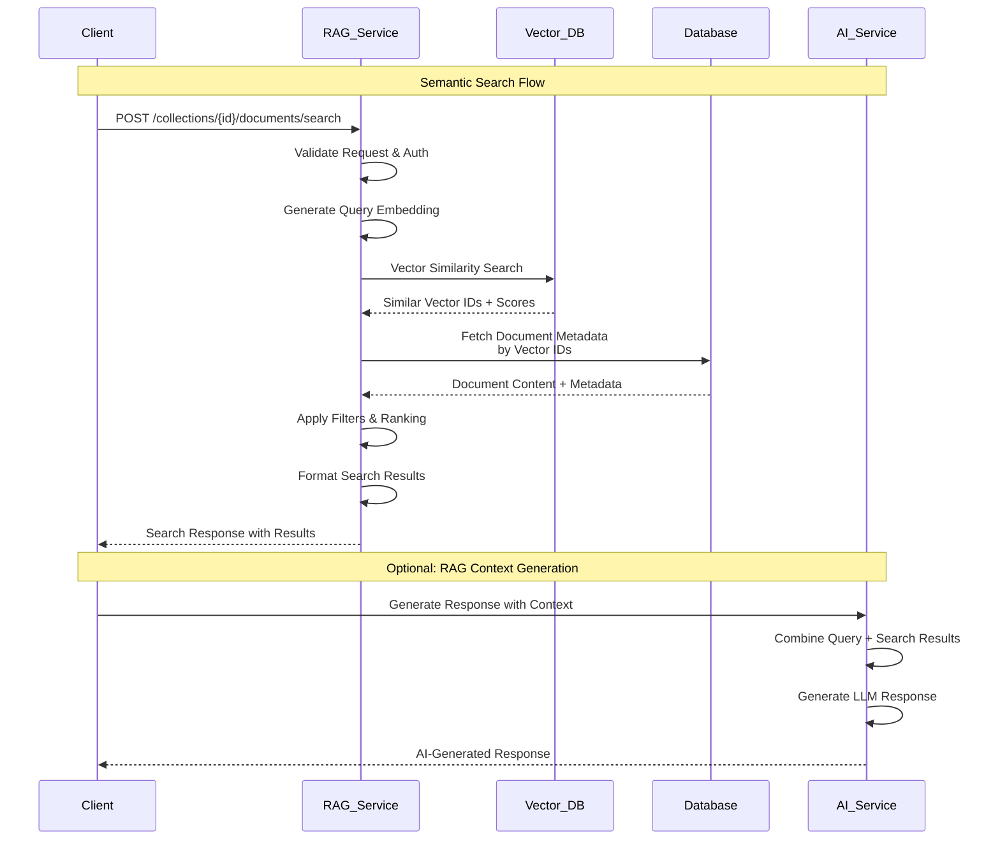
```mermaid
sequenceDiagram
    participant Client
    participant RAG_Service
    participant Vector_DB
    participant Database
    participant AI_Service
    
    Note over Client,AI_Service: Semantic Search Flow
    
    Client->>RAG_Service: POST /collections/{id}/documents/search
    RAG_Service->>RAG_Service: Validate Request & Auth
    RAG_Service->>RAG_Service: Generate Query Embedding
    
    RAG_Service->>Vector_DB: Vector Similarity Search
    Vector_DB-->>RAG_Service: Similar Vector IDs + Scores
    
    RAG_Service->>Database: Fetch Document Metadata<br/>by Vector IDs
    Database-->>RAG_Service: Document Content + Metadata
    
    RAG_Service->>RAG_Service: Apply Filters & Ranking
    RAG_Service->>RAG_Service: Format Search Results
    RAG_Service-->>Client: Search Response with Results
    
    Note over Client,AI_Service: Optional: RAG Context Generation
    Client->>AI_Service: Generate Response with Context
    AI_Service->>AI_Service: Combine Query + Search Results
    AI_Service->>AI_Service: Generate LLM Response
    AI_Service-->>Client: AI-Generated Response
```

### Hybrid Search Implementation

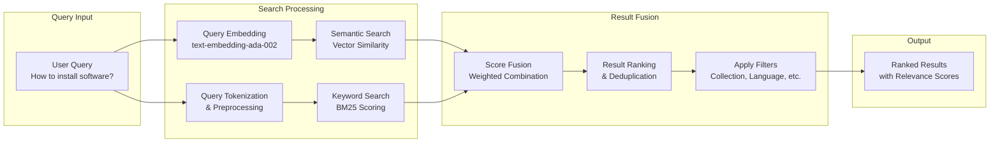
```mermaid
graph LR
    subgraph "Query Input"
        USER_QUERY[User Query<br/>How to install software?]
    end
    
    subgraph "Search Processing"
        SEMANTIC_SEARCH[Semantic Search<br/>Vector Similarity]
        KEYWORD_SEARCH[Keyword Search<br/>BM25 Scoring]
        EMBEDDING[Query Embedding<br/>text-embedding-ada-002]
        TOKENIZATION[Query Tokenization<br/>& Preprocessing]
    end
    
    subgraph "Result Fusion"
        SCORE_FUSION[Score Fusion<br/>Weighted Combination]
        RANKING[Result Ranking<br/>& Deduplication]
        FILTERING[Apply Filters<br/>Collection, Language, etc.]
    end
    
    subgraph "Output"
        RESULTS[Ranked Results<br/>with Relevance Scores]
    end
    
    USER_QUERY --> EMBEDDING
    USER_QUERY --> TOKENIZATION
    
    EMBEDDING --> SEMANTIC_SEARCH
    TOKENIZATION --> KEYWORD_SEARCH
    
    SEMANTIC_SEARCH --> SCORE_FUSION
    KEYWORD_SEARCH --> SCORE_FUSION
    
    SCORE_FUSION --> RANKING
    RANKING --> FILTERING
    FILTERING --> RESULTS
```

## Collection Management Workflow

### Collection Lifecycle

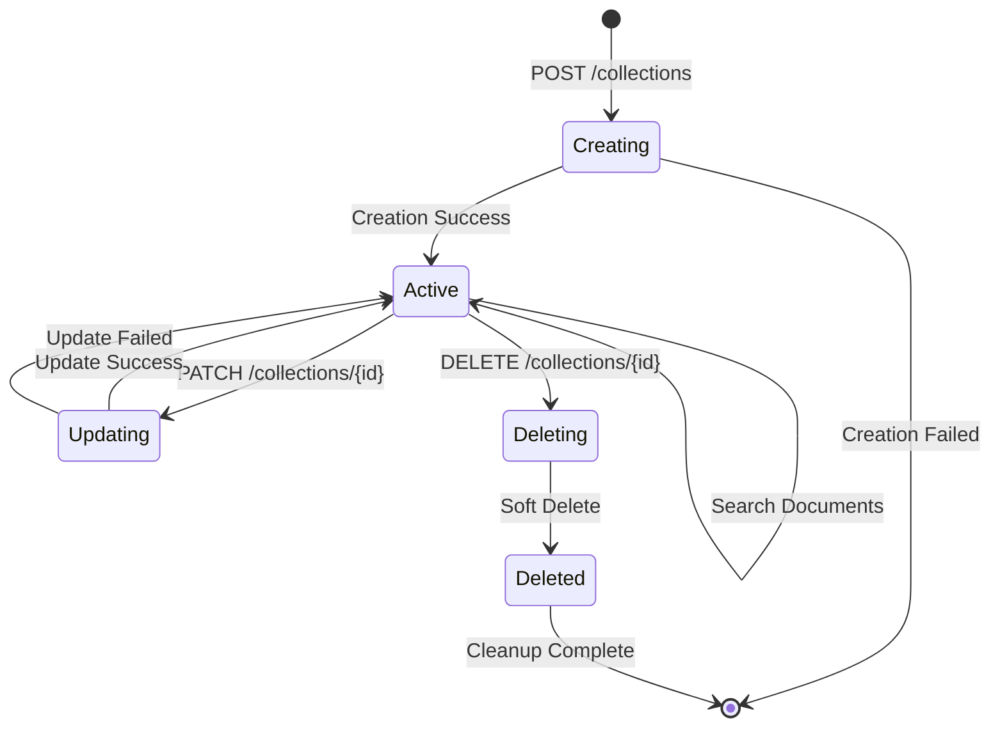
```mermaid
stateDiagram-v2
    [*] --> Creating: POST /collections
    Creating --> Active: Creation Success
    Creating --> [*]: Creation Failed
    
    Active --> Updating: PATCH /collections/{id}
    Updating --> Active: Update Success
    Updating --> Active: Update Failed
    
    Active --> Deleting: DELETE /collections/{id}
    Deleting --> Deleted: Soft Delete
    Deleted --> [*]: Cleanup Complete
    
    Active --> Active: Add Documents
    Active --> Active: Remove Documents
    Active --> Active: Search Documents
```

### Document-Collection Relationship Flow

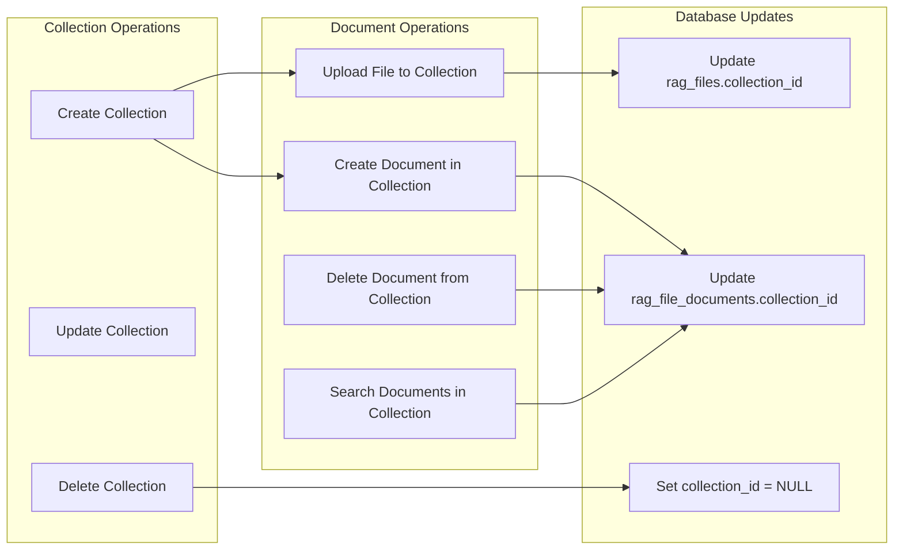
```mermaid
flowchart LR
    subgraph "Collection Operations"
        CREATE_COLL[Create Collection]
        UPDATE_COLL[Update Collection]
        DELETE_COLL[Delete Collection]
    end
    
    subgraph "Document Operations"
        UPLOAD_FILE[Upload File to Collection]
        CREATE_DOC[Create Document in Collection]
        SEARCH_DOC[Search Documents in Collection]
        DELETE_DOC[Delete Document from Collection]
    end
    
    subgraph "Database Updates"
        UPDATE_FILE_COLL[Update rag_files.collection_id]
        UPDATE_DOC_COLL[Update rag_file_documents.collection_id]
        NULLIFY_REFS[Set collection_id = NULL]
    end
    
    CREATE_COLL --> UPLOAD_FILE
    CREATE_COLL --> CREATE_DOC
    
    UPLOAD_FILE --> UPDATE_FILE_COLL
    CREATE_DOC --> UPDATE_DOC_COLL
    
    DELETE_COLL --> NULLIFY_REFS
    DELETE_DOC --> UPDATE_DOC_COLL
    
    SEARCH_DOC --> UPDATE_DOC_COLL
```

## Inter-Service Communication Patterns

### Event-Driven Architecture

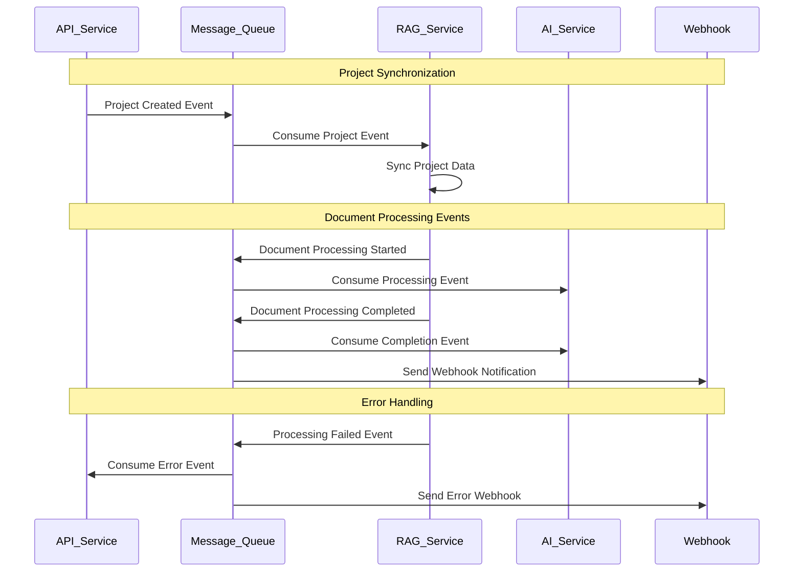
```mermaid
sequenceDiagram
    participant API_Service
    participant Message_Queue
    participant RAG_Service
    participant AI_Service
    participant Webhook
    
    Note over API_Service,Webhook: Project Synchronization
    API_Service->>Message_Queue: Project Created Event
    Message_Queue->>RAG_Service: Consume Project Event
    RAG_Service->>RAG_Service: Sync Project Data
    
    Note over API_Service,Webhook: Document Processing Events
    RAG_Service->>Message_Queue: Document Processing Started
    Message_Queue->>AI_Service: Consume Processing Event
    
    RAG_Service->>Message_Queue: Document Processing Completed
    Message_Queue->>AI_Service: Consume Completion Event
    Message_Queue->>Webhook: Send Webhook Notification
    
    Note over API_Service,Webhook: Error Handling
    RAG_Service->>Message_Queue: Processing Failed Event
    Message_Queue->>API_Service: Consume Error Event
    Message_Queue->>Webhook: Send Error Webhook
```

### Service Discovery & Health Checks

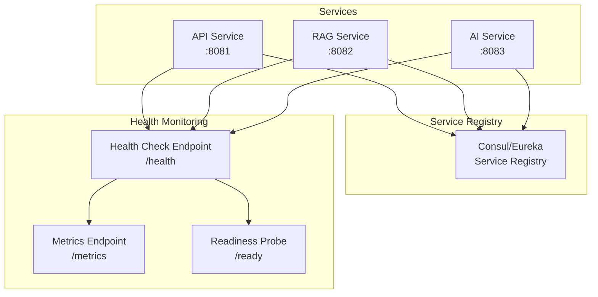
```mermaid
graph TB
    subgraph "Service Registry"
        CONSUL[Consul/Eureka<br/>Service Registry]
    end
    
    subgraph "Services"
        API_SVC[API Service<br/>:8081]
        RAG_SVC[RAG Service<br/>:8082]
        AI_SVC[AI Service<br/>:8083]
    end
    
    subgraph "Health Monitoring"
        HEALTH_CHECK[Health Check Endpoint<br/>/health]
        METRICS[Metrics Endpoint<br/>/metrics]
        READINESS[Readiness Probe<br/>/ready]
    end
    
    API_SVC --> CONSUL
    RAG_SVC --> CONSUL
    AI_SVC --> CONSUL
    
    API_SVC --> HEALTH_CHECK
    RAG_SVC --> HEALTH_CHECK
    AI_SVC --> HEALTH_CHECK
    
    HEALTH_CHECK --> METRICS
    HEALTH_CHECK --> READINESS
```

## Error Handling & Retry Mechanisms

### Error Handling Flow

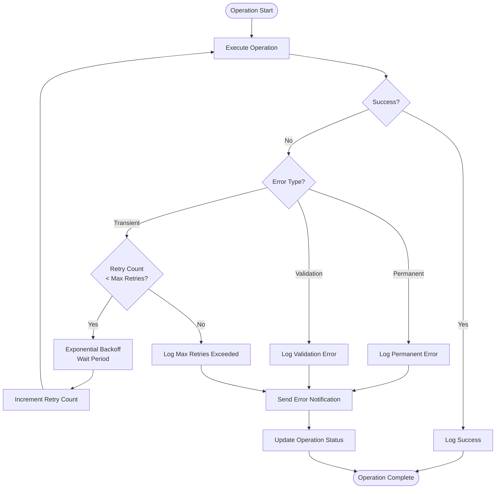
```mermaid
flowchart TD
    START([Operation Start]) --> TRY[Execute Operation]
    TRY --> SUCCESS{Success?}
    
    SUCCESS -->|Yes| LOG_SUCCESS[Log Success]
    LOG_SUCCESS --> END([Operation Complete])
    
    SUCCESS -->|No| ERROR_TYPE{Error Type?}
    
    ERROR_TYPE -->|Transient| RETRY_CHECK{Retry Count<br/>< Max Retries?}
    ERROR_TYPE -->|Permanent| LOG_ERROR[Log Permanent Error]
    ERROR_TYPE -->|Validation| LOG_VALIDATION[Log Validation Error]
    
    RETRY_CHECK -->|Yes| BACKOFF[Exponential Backoff<br/>Wait Period]
    RETRY_CHECK -->|No| LOG_MAX_RETRY[Log Max Retries Exceeded]
    
    BACKOFF --> INCREMENT[Increment Retry Count]
    INCREMENT --> TRY
    
    LOG_ERROR --> NOTIFY[Send Error Notification]
    LOG_VALIDATION --> NOTIFY
    LOG_MAX_RETRY --> NOTIFY
    
    NOTIFY --> UPDATE_STATUS[Update Operation Status]
    UPDATE_STATUS --> END
```

### Circuit Breaker Pattern

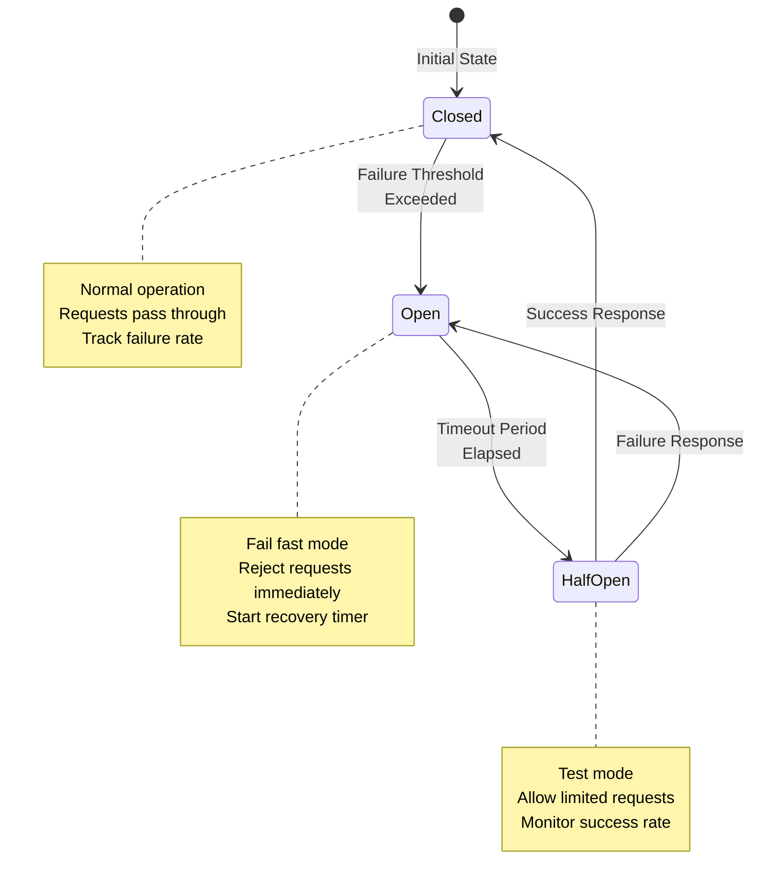
```mermaid
stateDiagram-v2
    [*] --> Closed: Initial State
    
    Closed --> Open: Failure Threshold<br/>Exceeded
    Open --> HalfOpen: Timeout Period<br/>Elapsed
    HalfOpen --> Closed: Success Response
    HalfOpen --> Open: Failure Response
    
    note right of Closed
        Normal operation
        Requests pass through
        Track failure rate
    end note
    
    note right of Open
        Fail fast mode
        Reject requests immediately
        Start recovery timer
    end note
    
    note right of HalfOpen
        Test mode
        Allow limited requests
        Monitor success rate
    end note
```

## Data Formats & Transformations

### Document Processing Data Flow

```mermaid
graph LR
    subgraph "Input Formats"
        PDF[PDF Files]
        DOC[Word Documents]
        TXT[Text Files]
        MD[Markdown Files]
        HTML[HTML Files]
    end
    
    subgraph "Processing Pipeline"
        EXTRACT[Content Extraction]
        CLEAN[Text Cleaning<br/>& Normalization]
        STRUCTURE[Structure Detection]
        CHUNK[Chunking Algorithm]
    end
    
    subgraph "Intermediate Format"
        JSON_DOC[Document JSON<br/>{title, content, metadata}]
    end
    
    subgraph "Output Formats"
        DB_RECORD[Database Record<br/>rag_file_documents]
        VECTOR[Vector Embedding<br/>Float Array]
        SEARCH_INDEX[Search Index<br/>Elasticsearch/Solr]
    end
    
    PDF --> EXTRACT
    DOC --> EXTRACT
    TXT --> EXTRACT
    MD --> EXTRACT
    HTML --> EXTRACT
    
    EXTRACT --> CLEAN
    CLEAN --> STRUCTURE
    STRUCTURE --> CHUNK
    
    CHUNK --> JSON_DOC
    
    JSON_DOC --> DB_RECORD
    JSON_DOC --> VECTOR
    JSON_DOC --> SEARCH_INDEX
```

### API Data Transformation

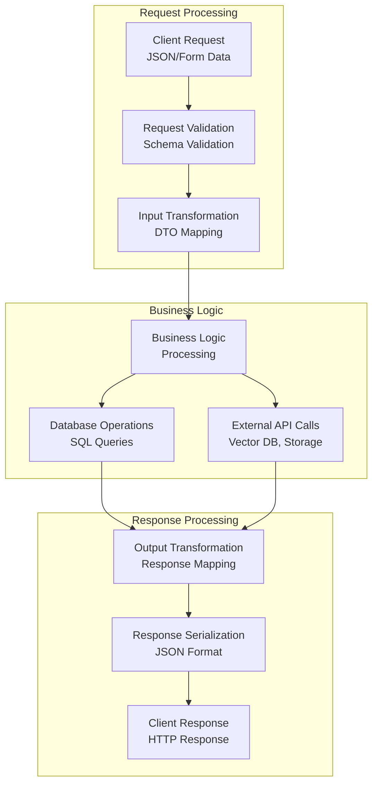
```mermaid
graph TB
    subgraph "Request Processing"
        CLIENT_REQ[Client Request<br/>JSON/Form Data]
        VALIDATION[Request Validation<br/>Schema Validation]
        TRANSFORM_IN[Input Transformation<br/>DTO Mapping]
    end
    
    subgraph "Business Logic"
        BUSINESS[Business Logic<br/>Processing]
        DB_QUERY[Database Operations<br/>SQL Queries]
        EXTERNAL[External API Calls<br/>Vector DB, Storage]
    end
    
    subgraph "Response Processing"
        TRANSFORM_OUT[Output Transformation<br/>Response Mapping]
        SERIALIZE[Response Serialization<br/>JSON Format]
        CLIENT_RESP[Client Response<br/>HTTP Response]
    end
    
    CLIENT_REQ --> VALIDATION
    VALIDATION --> TRANSFORM_IN
    TRANSFORM_IN --> BUSINESS
    
    BUSINESS --> DB_QUERY
    BUSINESS --> EXTERNAL
    
    DB_QUERY --> TRANSFORM_OUT
    EXTERNAL --> TRANSFORM_OUT
    TRANSFORM_OUT --> SERIALIZE
    SERIALIZE --> CLIENT_RESP
```

## Performance Optimization Workflows

### Batch Processing Pipeline

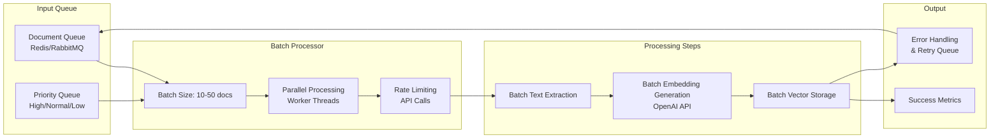
```mermaid
flowchart LR
    subgraph "Input Queue"
        QUEUE[Document Queue<br/>Redis/RabbitMQ]
        PRIORITY[Priority Queue<br/>High/Normal/Low]
    end

    subgraph "Batch Processor"
        BATCH_SIZE[Batch Size: 10-50 docs]
        PARALLEL[Parallel Processing<br/>Worker Threads]
        RATE_LIMIT[Rate Limiting<br/>API Calls]
    end

    subgraph "Processing Steps"
        EXTRACT_BATCH[Batch Text Extraction]
        EMBED_BATCH[Batch Embedding Generation<br/>OpenAI API]
        STORE_BATCH[Batch Vector Storage]
    end

    subgraph "Output"
        SUCCESS_LOG[Success Metrics]
        ERROR_RETRY[Error Handling<br/>& Retry Queue]
    end

    QUEUE --> BATCH_SIZE
    PRIORITY --> BATCH_SIZE
    BATCH_SIZE --> PARALLEL
    PARALLEL --> RATE_LIMIT

    RATE_LIMIT --> EXTRACT_BATCH
    EXTRACT_BATCH --> EMBED_BATCH
    EMBED_BATCH --> STORE_BATCH

    STORE_BATCH --> SUCCESS_LOG
    STORE_BATCH --> ERROR_RETRY
    ERROR_RETRY --> QUEUE
```

### Caching Strategy Implementation

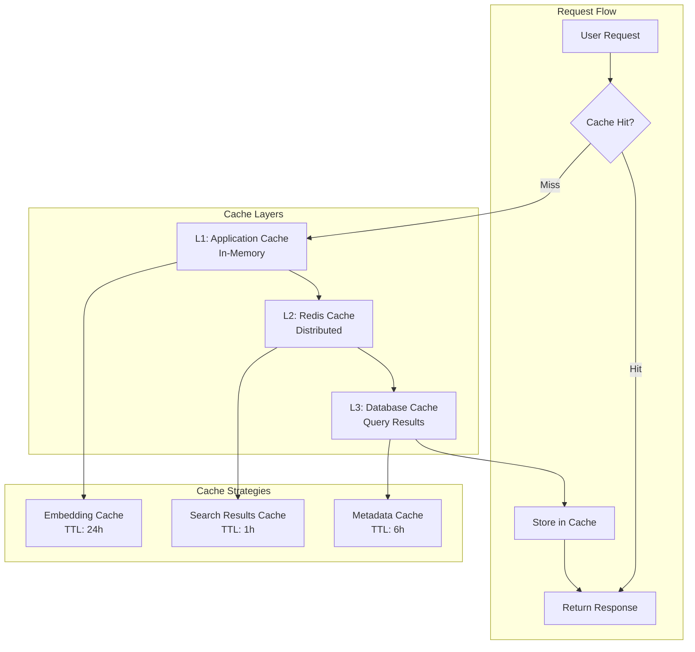
```mermaid
graph TB
    subgraph "Request Flow"
        USER_REQ[User Request]
        CACHE_CHECK{Cache Hit?}
        CACHE_STORE[Store in Cache]
        RESPONSE[Return Response]
    end

    subgraph "Cache Layers"
        L1_CACHE[L1: Application Cache<br/>In-Memory]
        L2_CACHE[L2: Redis Cache<br/>Distributed]
        L3_CACHE[L3: Database Cache<br/>Query Results]
    end

    subgraph "Cache Strategies"
        EMBEDDING_CACHE[Embedding Cache<br/>TTL: 24h]
        SEARCH_CACHE[Search Results Cache<br/>TTL: 1h]
        METADATA_CACHE[Metadata Cache<br/>TTL: 6h]
    end

    USER_REQ --> CACHE_CHECK
    CACHE_CHECK -->|Hit| RESPONSE
    CACHE_CHECK -->|Miss| L1_CACHE
    L1_CACHE --> L2_CACHE
    L2_CACHE --> L3_CACHE
    L3_CACHE --> CACHE_STORE
    CACHE_STORE --> RESPONSE

    L1_CACHE --> EMBEDDING_CACHE
    L2_CACHE --> SEARCH_CACHE
    L3_CACHE --> METADATA_CACHE
```

## Real-time Processing Workflows

### Streaming Document Processing

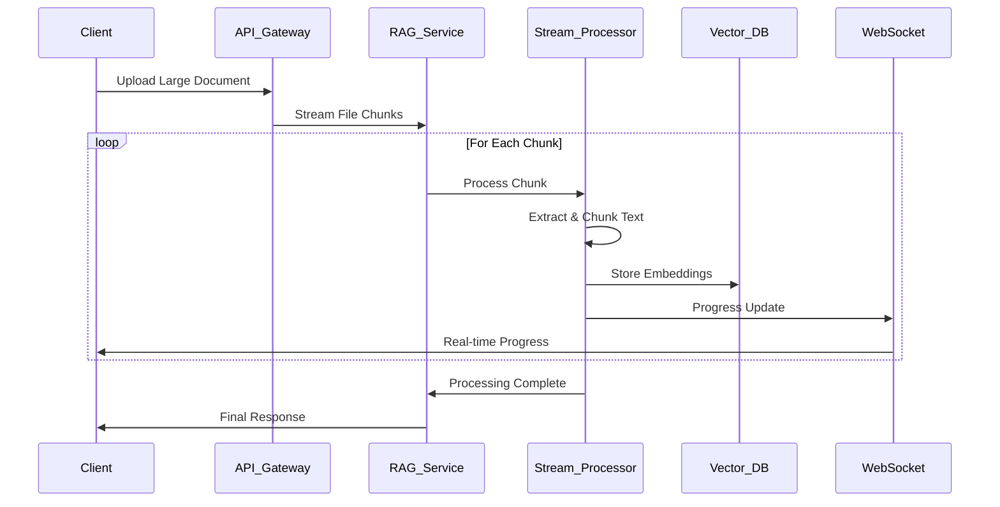
```mermaid
sequenceDiagram
    participant Client
    participant API_Gateway
    participant RAG_Service
    participant Stream_Processor
    participant Vector_DB
    participant WebSocket

    Client->>API_Gateway: Upload Large Document
    API_Gateway->>RAG_Service: Stream File Chunks

    loop For Each Chunk
        RAG_Service->>Stream_Processor: Process Chunk
        Stream_Processor->>Stream_Processor: Extract & Chunk Text
        Stream_Processor->>Vector_DB: Store Embeddings
        Stream_Processor->>WebSocket: Progress Update
        WebSocket->>Client: Real-time Progress
    end

    Stream_Processor->>RAG_Service: Processing Complete
    RAG_Service->>Client: Final Response
```

### Live Search Index Updates

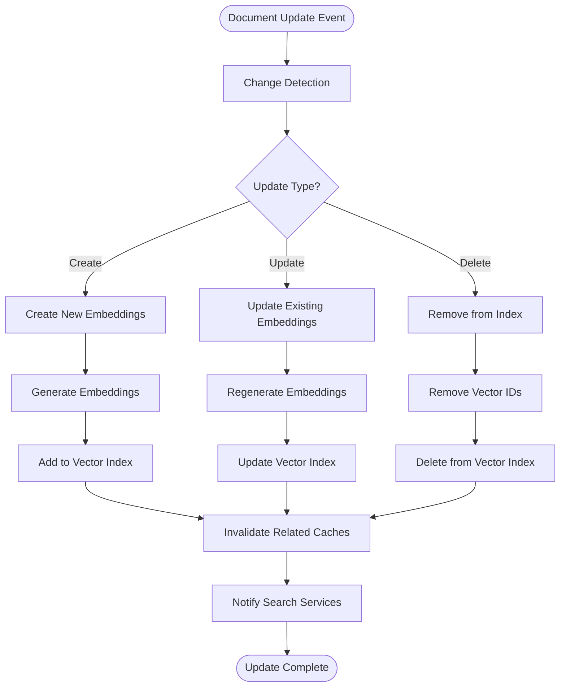
```mermaid
flowchart TD
    START([Document Update Event]) --> DETECT[Change Detection]
    DETECT --> TYPE{Update Type?}

    TYPE -->|Create| CREATE_FLOW[Create New Embeddings]
    TYPE -->|Update| UPDATE_FLOW[Update Existing Embeddings]
    TYPE -->|Delete| DELETE_FLOW[Remove from Index]

    CREATE_FLOW --> GENERATE[Generate Embeddings]
    UPDATE_FLOW --> REGENERATE[Regenerate Embeddings]
    DELETE_FLOW --> REMOVE[Remove Vector IDs]

    GENERATE --> INDEX_ADD[Add to Vector Index]
    REGENERATE --> INDEX_UPDATE[Update Vector Index]
    REMOVE --> INDEX_DELETE[Delete from Vector Index]

    INDEX_ADD --> CACHE_INVALIDATE[Invalidate Related Caches]
    INDEX_UPDATE --> CACHE_INVALIDATE
    INDEX_DELETE --> CACHE_INVALIDATE

    CACHE_INVALIDATE --> NOTIFY[Notify Search Services]
    NOTIFY --> END([Update Complete])
```

## Advanced Search Workflows

### Multi-Modal Search Pipeline

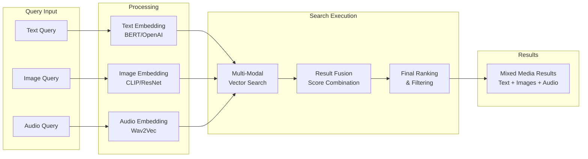
```mermaid
graph LR
    subgraph "Query Input"
        TEXT_QUERY[Text Query]
        IMAGE_QUERY[Image Query]
        AUDIO_QUERY[Audio Query]
    end

    subgraph "Processing"
        TEXT_EMBED[Text Embedding<br/>BERT/OpenAI]
        IMAGE_EMBED[Image Embedding<br/>CLIP/ResNet]
        AUDIO_EMBED[Audio Embedding<br/>Wav2Vec]
    end

    subgraph "Search Execution"
        VECTOR_SEARCH[Multi-Modal<br/>Vector Search]
        FUSION[Result Fusion<br/>Score Combination]
        RANKING[Final Ranking<br/>& Filtering]
    end

    subgraph "Results"
        MIXED_RESULTS[Mixed Media Results<br/>Text + Images + Audio]
    end

    TEXT_QUERY --> TEXT_EMBED
    IMAGE_QUERY --> IMAGE_EMBED
    AUDIO_QUERY --> AUDIO_EMBED

    TEXT_EMBED --> VECTOR_SEARCH
    IMAGE_EMBED --> VECTOR_SEARCH
    AUDIO_EMBED --> VECTOR_SEARCH

    VECTOR_SEARCH --> FUSION
    FUSION --> RANKING
    RANKING --> MIXED_RESULTS
```

### Contextual Search Enhancement

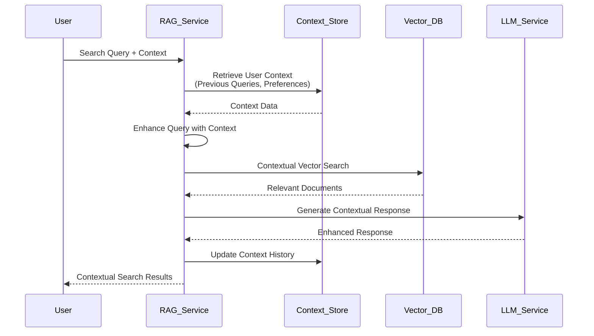
```mermaid
sequenceDiagram
    participant User
    participant RAG_Service
    participant Context_Store
    participant Vector_DB
    participant LLM_Service

    User->>RAG_Service: Search Query + Context
    RAG_Service->>Context_Store: Retrieve User Context<br/>(Previous Queries, Preferences)
    Context_Store-->>RAG_Service: Context Data

    RAG_Service->>RAG_Service: Enhance Query with Context
    RAG_Service->>Vector_DB: Contextual Vector Search
    Vector_DB-->>RAG_Service: Relevant Documents

    RAG_Service->>LLM_Service: Generate Contextual Response
    LLM_Service-->>RAG_Service: Enhanced Response

    RAG_Service->>Context_Store: Update Context History
    RAG_Service-->>User: Contextual Search Results
```

## Data Quality & Validation Workflows

### Document Quality Assessment

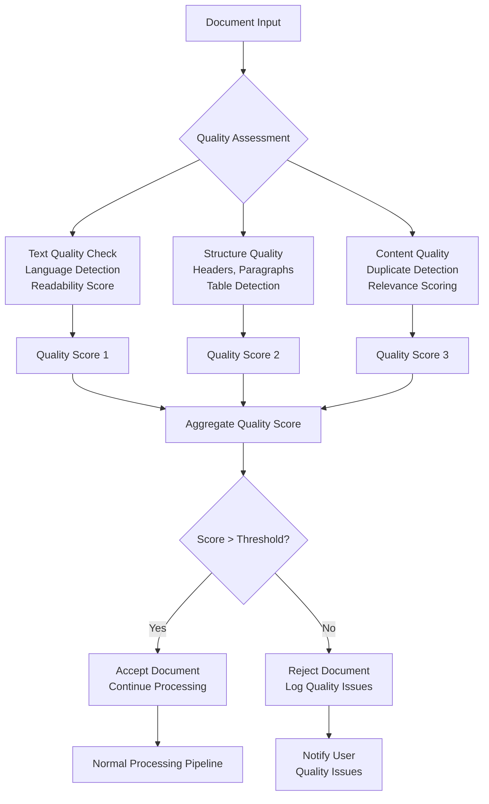
```mermaid
flowchart TD
    DOC_INPUT[Document Input] --> QUALITY_CHECK{Quality Assessment}

    QUALITY_CHECK --> TEXT_QUALITY[Text Quality Check<br/>Language Detection<br/>Readability Score]
    QUALITY_CHECK --> STRUCTURE_QUALITY[Structure Quality<br/>Headers, Paragraphs<br/>Table Detection]
    QUALITY_CHECK --> CONTENT_QUALITY[Content Quality<br/>Duplicate Detection<br/>Relevance Scoring]

    TEXT_QUALITY --> SCORE1[Quality Score 1]
    STRUCTURE_QUALITY --> SCORE2[Quality Score 2]
    CONTENT_QUALITY --> SCORE3[Quality Score 3]

    SCORE1 --> AGGREGATE[Aggregate Quality Score]
    SCORE2 --> AGGREGATE
    SCORE3 --> AGGREGATE

    AGGREGATE --> THRESHOLD{Score > Threshold?}
    THRESHOLD -->|Yes| ACCEPT[Accept Document<br/>Continue Processing]
    THRESHOLD -->|No| REJECT[Reject Document<br/>Log Quality Issues]

    ACCEPT --> PROCESS[Normal Processing Pipeline]
    REJECT --> NOTIFY[Notify User<br/>Quality Issues]
```

### Embedding Quality Validation

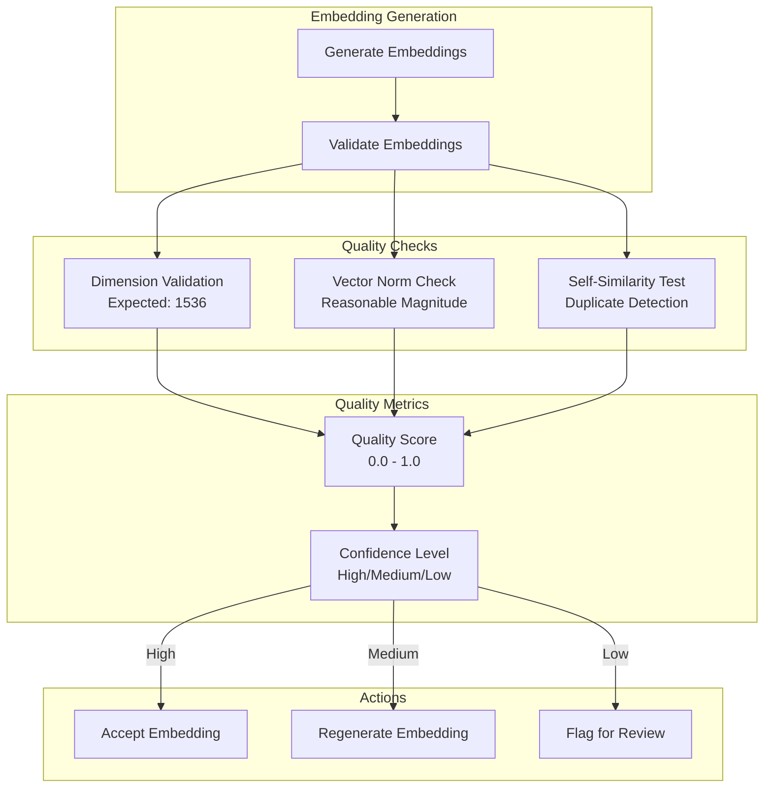
```mermaid
graph TB
    subgraph "Embedding Generation"
        GENERATE[Generate Embeddings]
        VALIDATE[Validate Embeddings]
    end

    subgraph "Quality Checks"
        DIMENSION_CHECK[Dimension Validation<br/>Expected: 1536]
        NORM_CHECK[Vector Norm Check<br/>Reasonable Magnitude]
        SIMILARITY_CHECK[Self-Similarity Test<br/>Duplicate Detection]
    end

    subgraph "Quality Metrics"
        QUALITY_SCORE[Quality Score<br/>0.0 - 1.0]
        CONFIDENCE[Confidence Level<br/>High/Medium/Low]
    end

    subgraph "Actions"
        ACCEPT_EMBED[Accept Embedding]
        REGENERATE[Regenerate Embedding]
        FLAG_REVIEW[Flag for Review]
    end

    GENERATE --> VALIDATE
    VALIDATE --> DIMENSION_CHECK
    VALIDATE --> NORM_CHECK
    VALIDATE --> SIMILARITY_CHECK

    DIMENSION_CHECK --> QUALITY_SCORE
    NORM_CHECK --> QUALITY_SCORE
    SIMILARITY_CHECK --> QUALITY_SCORE

    QUALITY_SCORE --> CONFIDENCE

    CONFIDENCE -->|High| ACCEPT_EMBED
    CONFIDENCE -->|Medium| REGENERATE
    CONFIDENCE -->|Low| FLAG_REVIEW
```

This comprehensive data flow documentation covers all aspects of data movement, processing, and optimization within the RAG service, providing clear visibility into both standard operations and advanced workflows.
